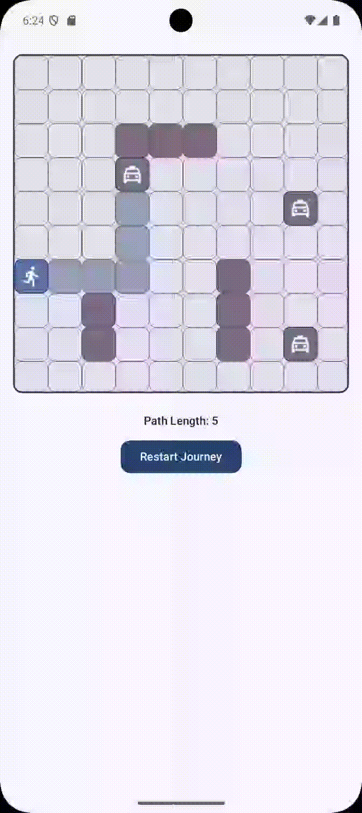

# RoadRunner 🚖🏃‍♂️

Welcome to **RoadRunner** — a fun and dynamic app where you can find the closest Taxi!  
Each tap reveals the taxi’s fastest path toward you...

---

## ✨ Features
- **Dynamic Grid Configuration:** Set the number of grid cells and taxis easily with the `GameConfig` class.
- **Real-Time Game Engine:** The `GameEngine` is the brain of the game, coordinating all movements, updates, and interactions.
- **Synchronized Gameplay:** The `Ticker` acts as a central clock, synchronizing every action in the game using Kotlin's Flow API.
- **Smart Grid Navigation:** The `SquareGrid` class intelligently finds neighboring cells while respecting grid boundaries and obstacles.
- **Obstacle Generation:** The `WallsProvider` populates the grid with walls, adding strategic complexity and challenge.
- **Taxi AI with Random Strategy:** The `RandomMovementStrategy` defines how taxis move. If a taxi gets stuck, it tries to find a random way out to keep the chase alive!
- **Interactive Shortest Path Finding:** Tap on any taxi to freeze all taxis and display the shortest path from that taxi to the runner — powered by **Breadth-First Search (BFS)**.

---

## 🚀 How It Works

- Two types of characters roam the grid:
  - **Runner**: Your goal is to avoid getting caught.
  - **Taxis**: Constantly on the move, trying to catch you.
- **Gameplay mechanics:**
  1. **Tap on a Taxi** 🖐️: All taxis freeze.
  2. The selected taxi calculates and displays the shortest path to the runner using **BFS**.
  3. Watch carefully! Understanding the taxi paths will help you plan your next move.

---

## 🧩 Core Components

| Class | Responsibility |
| :--- | :--- |
| `GameConfig` | Sets the number of grid cells and number of taxis. |
| `GameEngine` | Acts as the control center and handles the game's main logic. |
| `Ticker` | Keeps the game synchronized by emitting clock ticks through a Flow. |
| `SquareGrid` | Calculates neighbors of cells within the grid while considering grid limitations and obstacles. |
| `WallsProvider` | Randomly places walls on the playground grid to create challenges. |
| `RandomMovementStrategy` | Guides taxi movement and resolves deadlocks by selecting random available directions. |

---

## 🛠 Tech Stack

- Kotlin
- Coroutines & Flow
- Jetpack Compose
- Breadth-First Search (BFS) for pathfinding
- Object-Oriented Design

---

## 🎯 Why This Project?

It was created **just for fun!** 🎉  
The goal was to experiment with movement synchronization, pathfinding, and reactive programming in a playful and interactive way.

---

## 📸 Screenshot

---

## 💡 Future Improvements

- Smarter taxi strategies (e.g., predictive movement!)
- Runner power-ups and bonus tiles
- Multi-level grids
- Leaderboard for fastest escapes
